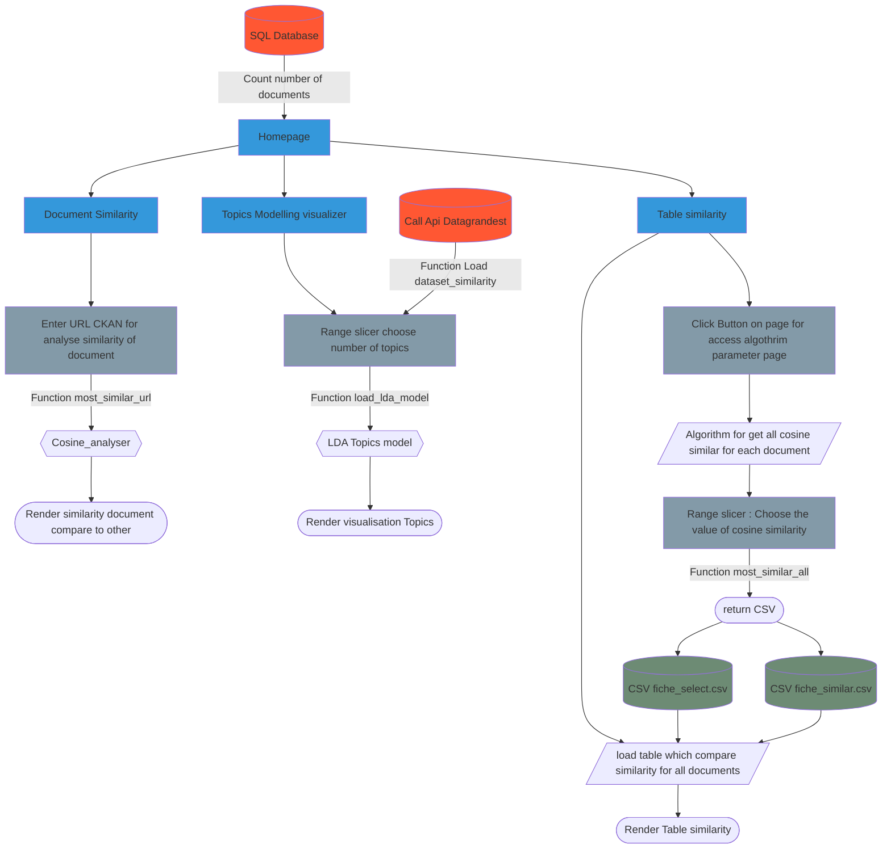
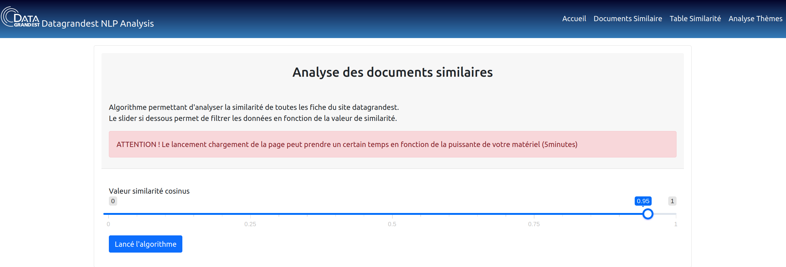

# Documentation
## Présentation du projet  : Analyse des fiches de données Datagrandest

Ce projet s'inscrit dans une analyse exploratoire des jeux de données disponible sur le [site Datagrandest](https://www.datagrandest.fr/portail/fr).

**Objectifs de l'analyse :** </br>
- Créer un algorithme capable de vérifier si il existe des **doublons dans les jeux de données** présent sur le site datagrandest . </br>
- Créer un algorithme capable de **classer les jeux de données par thèmes**.

Ce projet réunie ces algorithme dans **une application web flask**.

## Installation 
1. Récupérer le projet sur Github.
2. Créer un environnement virtuel python via **conda** ou **venv**.
3. Installer les packages nécessaires au projet via le `requirements.txt` avec la commande :

``` bash
pip install -r requirements.txt
```
### Lancement de l'application Web 
A la racine du projet exécuté les commandes suivantes dans le terminal :
``` bash
export FLASK_APP=flask_app
export FLASK_DEBUG=1
flask run
```
## Schéma de l'application Web

## Analyse des Documents similaires 
### Documents Similaires
Permet de tester la similarités d'une fiche de données par rappport aux autres en utilisant l'url d'une fiche datagrandest.
!!! note "Choix d'un URL sur CKAN"

  Pour choisir une fiche et récuperer son URL correspondant, selectionner une fiche sur [CKAN](https://grandestprod-backoffice.data4citizen.com/dataset)</br>
  **exemple URL de fiche de donnée** :</br> <https://grandestprod-backoffice.data4citizen.com/dataset/donnee-grand-est-terre-de-jeux-2024>

### Table Similarités 
Tableau permettant de comparer la similarité de toutes les fiches du site datagrandest.
Le tableau regroupe pour chaques fiches :

1. L'url de la fiche dont la similarité est testée
2. L'url de la fiche similaire 
3. La similarité cosinus entre les deux fiches
#### Mettre à jour les données du tableau et choix de la similarité cosinus
Les données du tableau peuvent être mis à jour en cliquant sur le button `Chargement de l'algorithme de similarité` sur la page réunissant la table.
Vous accéderez a une interface vous permettant de choisir la similarité cosinus (valeur entre 0 et 1).</br>
<figure markdown>

<figcaption>Interface Algorithme similarité </figcaption>
</figure>
## Extraction des thèmes 